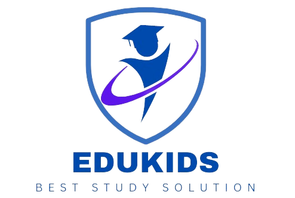

# EduKids Website

EduKids adalah platform pembelajaran online yang menyediakan beragam kursus, seperti matematika, sains, IPS, dan banyak lagi. Kami telah merancang platform ini dengan tujuan memberikan pendidikan berkualitas tinggi yang juga terjangkau bagi anak-anak dari segala usia. Kursus-kursus kami dirancang agar menarik dan interaktif, dengan tim guru berpengalaman yang selalu siap membantu dan mendukung anak-anak dalam setiap langkah pembelajarannya.

## 🎁Key Features

Berikut adalah beberapa fitur yang terdapat dalam website EduKids:

1. **Kursus Beragam**: Pengguna dapat mengakses berbagai kursus dalam berbagai bidang, seperti matematika, ilmu pengetahuan alam, IPS, bahasa, dan banyak lagi. Ini memungkinkan pengguna untuk memilih kursus yang sesuai dengan minat dan kebutuhan mereka.

2. **Mode Belajar yang Fleksibel**: EduKids menawarkan mode belajar yang fleksibel, yang memungkinkan pengguna untuk belajar sesuai dengan jadwal mereka sendiri. Pengguna dapat belajar kapan saja dan di mana saja, sehingga cocok untuk pengguna dengan jadwal yang sibuk.

3. **Promo dan Diskon**: Website ini menyediakan promo dan diskon khusus, sehingga membuat belajar lebih terjangkau bagi pengguna. Ini bisa menjadi insentif yang baik untuk pengguna yang ingin menghemat biaya.

4. **Interaktif**: Kursus-kursus di EduKids dirancang agar interaktif dan menginspirasi. Ini dapat membantu pengguna tetap termotivasi dan terlibat dalam pembelajaran mereka.

5. **Pilihan Tingkat Pendidikan**: Ada pilihan kursus untuk berbagai tingkat pendidikan, termasuk SD, SMP, dan SMA. Ini memungkinkan pengguna untuk memilih kursus yang sesuai dengan tingkat pendidikan mereka.

6. **Informasi Detail**: Setiap kursus dilengkapi dengan informasi detail, seperti jumlah pelajaran, jumlah siswa, dan harga. Ini membantu pengguna untuk membuat keputusan yang lebih baik tentang kursus yang ingin mereka ikuti.

7. **Rating dan Ulasan**: Pengguna dapat melihat rating dan ulasan dari kursus-kursus sebelumnya. Ini membantu pengguna untuk mendapatkan wawasan tentang kualitas kursus tersebut.

## 🕹 How to Run the Project
Buka situs pada link berikut - klik link :   
 

## 🤗 Tim Pengembangan
EduKids adalah proyek yang dibangun dengan konsentrasi dan harapan besar oleh Grub 16 Section Semarang, MSIB ( [RevoU](https://revou.co/) x [MSIB Kemendikbudristek](https://www.kemdikbud.go.id/) ).    Terima kasih kepada semua kontributor yang telah berpartisipasi dalam pengembangan situs ini.
